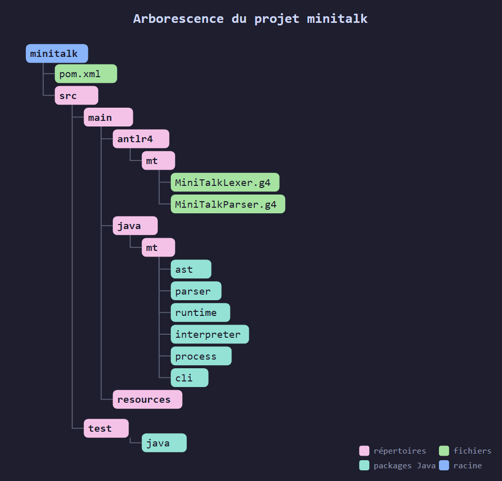

# MiniTalk V3 - Architecture


## Présentation


MiniTalk est un langage de scripting orienté objets inspiré de Smalltalk.


Son objectif principal est l'automatisation, l'orchestration de processus et la manipulation de flux tout en conservant un modèle objet simple fondé sur l'envoi de messages.


MiniTalk n'est pas :


- un clone de Smalltalk ;

- un clone de Java ;

- un shell Unix amélioré.


MiniTalk est un langage moderne utilisant les concepts fondamentaux de Smalltalk tout en simplifiant sa syntaxe et son architecture.


---


# Objectifs


Les objectifs principaux de MiniTalk sont :


- simplicité ;

- lisibilité ;

- extensibilité ;

- intégration naturelle avec Java ;

- manipulation aisée des processus et pipelines ;

- modèle objet cohérent.


Les objectifs non retenus pour la V3 :


- métaclasses ;

- compilation native ;

- machine virtuelle dédiée ;

- système de types complexe ;

- optimisation prématurée.


---


# Plateforme technique


## Langage d'implémentation


```text

Java 25

```


## Parsing


```text

ANTLR v4

```


## Build


```text

Maven

```


---


# Structure du projet


Dans un premier temps, MiniTalk est un projet Maven simple (mono-module).




```text

minitalk

│
├── pom.xml
│
└── src
     ├── main
     │   ├── antlr4
     │   │   └── mt
     │   │       ├── MiniTalkLexer.g4
     │   │       └── MiniTalkParser.g4
     │   │
     │   ├── java
     │   │   └── mt
     │   │       ├── ast
     │   │       ├── parser
     │   │       ├── runtime
     │   │       ├── interpreter
     │   │       ├── process
     │   │       └── cli
     │   │
     │   └── resources
     │
     └── test
          └── java

```


---


# Architecture générale


Le code source suit le chemin suivant :


```text

Source MiniTalk
       ↓
  ANTLR Lexer
       ↓
  ANTLR Parser
       ↓
  Parse Tree
       ↓
  AST Builder
       ↓
  AST immutable
       ↓
  Interpreter
       ↓
    Runtime

```


Le Parse Tree ANTLR ne doit jamais être exécuté directement.


Un AST spécifique à MiniTalk est construit avant l'interprétation.


---


# Convention Java


Toutes les classes internes du runtime sont préfixées par :


```text

MT

```


Exemples :


```java

MTObject

MTClass

MTInstance

MTMethod


MTInteger

MTFloat

MTString

MTSymbol


MTArray

MTDictionary


MTCommand

MTProcess

MTPipeline

```


Cette convention évite les conflits avec le JDK :


```java

Object

Class

Process

Runtime

Module

Package

```


Le préfixe MT n'est jamais visible dans le langage MiniTalk.


---


# Modèle objet


MiniTalk est entièrement orienté objets : tout y est objet.

Une classe est elle-même un objet spécial.

Les métaclasses ne sont pas supportées.

Les classes primitives  de miniTalk sont organisées de la façon suivante :

```text
Object
  │
  ├─── Class
  ├─── Number 
  │      │
  │      ├─── Integer
  │      └─── Float
  ├─── Collection
  │         │
  │         ├─── Array
  │         └─── Dictionary
  ├─── Stream
  ├─── Command
  ├─── Process
  ├─── Block
  ├─── String
  ├─── Symbol
  ├─── Boolean
  │      │
  │      ├─── True
  │      └─── False
  │
  └─── Nil
```

Cette hiérarchie décrit les classes MiniTalk.

Elle ne préjuge pas de la hiérarchie Java utilisée pour les implémenter.

---


## Une classe contient


```text

id
name
superclass

instVars
classVars

instMethods
classMethods
```


is, name et superclass sont des metadonnées.
* **id** l'identifiant unique de l'objet courant
* **name** indique le nom de la classe.
* **superclass** pointe sur la classe parente dans la hiérarchie


Les variables sont stockées dans instVars et classVars.

* **instVars** référence les variables d'instance à valoriser dans l'objet final. C'est un Array de symboles.

  Exemple :


  ```smalltalk
  #pid
  #stdout
  #stderr
  ```

* **classVars** référence les variables de classe ET leurs valeurs. C'est un dictionnaire de type clé/valeurs avec pour les clés des symboles, et pour les valeurs des objets.


Les méthodes seront elles aussi distinguées en deux types :
* **instMethods** : un dictionnaires référençant les méthodes s'appliquant aux instances
* **classMethods** : un dictionnaire référençant les méthodes s'appliquant aux classes

En Java, l'implémentation de la classe sera donc :

```java
public final class MTClass
        implements MTObject {
    private final int    id;
    private final String name;
    private final MTClass superclass;
    private final List<MTSymbol> instVars;
    private final Map<MTSymbol, MTObject> classVars;
    private final Map<MTSymbol, MTMethod> instMethods;
    private final Map<MTSymbol, MTMethod> classMethods;
}
```

A noter que les méthodes peuvent être de deux types :
* en java natif pour les méthodes initiées par le bootstrap
* en blocks miniTalk, pour les méthodes définies dans miniTalk lui-même

```java
MTNativeMethod
MTBlockMethod
```

## les Instances

Les instances de la classe Classe exceptées, toutes les instances de classes sont des objets ordinaires dérivés eux aussi de MTObject, dont la classe Java parente est MTInstance.

Une instance contient donc au minimum :
* un id unique
* la classe parente
* la liste de ses propriétés et de leurs valeurs

```java
public final class MTInstance
        implements MTObject {

    private final int     id;
    
    private final MTClass mtClass;

    private final Map<MTSymbol, MTObject> properties;
}

```

---

## Runtime Bootstrap

Les classes fondamentales du runtime (Object, Class, Integer, String, etc.)
sont bootstrapées en Java.

Au démarrage :

```text
create Object
create Class
wire Object/Class relationship
create Nil
create Boolean
create Integer
...
```

Dans ce bootstrap, en termes de relation (exprimée ici en miniTalk, mais à implémenté en Java) :
```smalltalk
Object  class: Class.
Object  super: nil.
Class   class: Class.
Class   super: Object.
```
et Class auront un mtClass pointant sur Class (une détection des boucles dans le lookup sera à prévoir)

Leurs comportements initiaux sont implémentés par des MTNativeMethod.

Les classes utilisateur peuvent ensuite ajouter des méthodes définies en MiniTalk.


---

## Définition des classes

MiniTalk conserve l'esprit Smalltalk : les classes sont créées et enrichies par envoi de messages.

### Création d'une classe

```smalltalk
Person <- Object subclass: #Person.
```

ou avec héritage explicite :

```smalltalk
Employee <- Person subclass: #Employee.
```

La création d'une classe retourne un objet classe.

### Enrichissement d'une classe

Une classe peut être enrichie progressivement par envoi de messages.

#### Variables d'instance

```smalltalk
Person << instVars: #( #name #age ).
```

#### Variables de classe

```smalltalk
Person << classVars: #( #Population ).
```

#### Méthodes d'instance

```smalltalk
Person << instMethods: [

    greet [
        ('Bonjour ' + name) println.
    ]

    name: newName [
        name <- newName trim.
    ]

].
```

#### Méthodes de classe

```smalltalk
Person << classMethods: [

    newNamed: aName [

        p <- self new.
        p name: aName.
        ^p

    ]

].
```

### Philosophie

Le message `<<` est utilisé pour enrichir une classe existante.

Il ne représente pas une métaclasse et n'introduit aucun mécanisme spécial dans le langage.

Conceptuellement :

```smalltalk
Person << instVars: ...
Person << classVars: ...
Person << instMethods: ...
Person << classMethods: ...
```

sont simplement des envois de messages à un objet classe.


---

# Classes fondamentales


La V3 fournit les classes suivantes :


```text

Object

Class


Boolean

Nil


Integer

Float


String

Symbol


Array

Dictionary


Block


Command

Process

Stream

```


---


# Interface MTObject


Interface racine de tous les objets du runtime.


```java

public interface MTObject {
    MTClass getMTClass();
      MTObject send(
      MTSymbol selector,
      MTObject... arguments
    ) throws MTException;

    boolean identityEquals(
      MTObject other);

    MTString asString()
      throws MTException;

    default boolean isNil() {
      return false;
    }

    default boolean isTrue() {
      return true;
    }

    default boolean isFalse() {
      return false;
    }

}

```


---


# Syntaxe


## Affectation

MiniTalk accepte deux syntaxes équivalentes.

```smalltalk
name <- 'Bob'.
count <- 42.
```

ou

```smalltalk
name := 'Bob'.
count := 42.
```

Les deux syntaxes produisent exactement le même AST.


---


## Messages unaires


```smalltalk

person name


process run


array size

```


---


## Messages binaires


```smalltalk

1 + 2


10 - 4

```

Note importante concernant les opérateurs : 

contrairement à Smalltalk qui les considérent comme des messages binaires normaux pouvant s'enchaîner les uns après les autres, ceux-ci suivent les règles de précédence usuelles définies dans d'autres langages comme le C ou Java. Ainsi :

```smalltalk
1 + 2 * 3
```

aura pour résultat : 7, car l'expression sera interprétée :  1 + (2 * 3), et non comme (1 + 2) * 3, ce qui aurait donné le chiffre 9.

Les règles de précédence des opérateurs sont les suivantes, de la plus élevée à la moins élevée :
* '\+', '\-' : les opérateurs unaires donnant le signe d'un nombre (-6, +5.34, etc)
* '\*\*' : puissance ( exemple : 2 ** 7 )
* '\*', '\/', '\%' : multiplication et division, modulo (reste de la division entière)
* '\+', '\-' : addition et soustraction

---


## Messages à mots-clés


```smalltalk

dict at: #name


dict at: #name put: 'Bob'

```


---

# Résolution des messages

Lorsqu'un objet normal reçoit un message :

1. recherche dans les méthodes de sa classe;
2. recherche dans les méthodes de sa superclasse;
3. poursuite jusqu'à Object.

Si aucune méthode n'est trouvée : MTMessageNotUnderstoodException


Lorsqu'une classe reçoit un message :

1. recherche dans ses méthodes de classe,
2. recherche dans les méthodes de classe de la superclasse;
3. poursuite jusqu'à Object.

Si aucune méthode n'est trouvée : MTMessageNotUnderstoodException

---


# Accès pointé


MiniTalk accepte une notation moderne basée sur le point.


Exemple :


```smalltalk

proc.stdout


proc.stderr


proc.exitCode

```


Cette notation est un sucre syntaxique transformé par le parser en :


```smalltalk

proc stdout


proc stderr


proc exitCode

```


---


# Blocs


## Sans argument


```smalltalk

[
   'hello' println.
]

```


## Avec arguments


```smalltalk

[:line |
   line println.
]

```


Les blocs sont des objets de première classe.


Ils sont utilisés notamment pour :


- traitements de flux ;

- callbacks ;

- gestion d'erreur ;

- itérations.


---

# Les Scopes et la sortie de bloc

On ne peut parler de blocs, sans s'interroger sur deux mécanismes importants :
* la valorisation des variables d'un bloc à un autre. C'est ce que se propose de gérer les scopes.
* le retour des valeurs. Comme tout objet, un bloc retourne une valeur, laquelle et comment ?

## les scopes


Chaque bloc exécuté possède un scope.

Un scope contient :

- les variables locales du bloc ;
- une référence vers son scope parent.

Représentation interne :

```java
public final class MTScope {

    private final MTScope parent;

    private final Map<MTSymbol, MTObject> variables;
}
```

Lorsqu'une variable est recherchée :

1. scope courant
2. scope parent
3. scope parent du parent
4. etc.

Lorsqu'une variable est assignée :

* si elle existe dans un scope visible : mise à jour de cette variable
* sinon : création dans le scope courant


## le retour ^

'^' est utilisé pour sortir d'un bloc en émettant une valeur.

Contrairement à smalltalk, '^', en miniTalk, a été pensé pour uniquement sortir du bloc courant, et non remonter toute la chaîne des blocs. 

Ainsi si on rencontre :

```smalltalk
[
  ^42.
  99
]
```
La valeur résultante de l'exécution de ce bloc sera : 42


Second exemple :

```smalltalk
[
  v <- [
    ^42.
    99
  ] value.
  
  v <- v + 20.
  ^v.
  
  999
] value.

```
En smalltalk natif, le retour de ce bloc serait : 42, car on sortirait immédiatement, également, de tous les blocs englobants. 

En miniTalk, il sera : 62, car le calcul contuinue dans le bloc englobant.

---


# Gestion des erreurs


Toutes les erreurs MiniTalk dérivent de :


```java

MTException

```


---


## Hiérarchie actuelle


```text

MTException
   |
   +-- MTMessageNotUnderstoodException
   |
   +-- MTTypeException
   |
   +-- MTArithmeticException
   |
   +-- MTProcessException
   |
   +-- MTIOException
   |
   +-- MTParseException
   |
   +-- MTInterpreterException

```


---


## Syntaxe retenue


La V3 utilise un message :


```smalltalk

catch:

```


Exemple :


```smalltalk

[
   dangerousOperation.
]
catch: [:e |
   e message println.
].

```

La syntaxe historique de Smalltalk :


```smalltalk

on:do:

```

n'est pas retenue.


---


# Collections


## Array


```smalltalk

#(1 2 3)

```


ou


```smalltalk

Array with: 1 with: 2 with: 3.

```


---


## Dictionary


```smalltalk

{
   #name => 'Bob'.
   #age  => 42.
}

```

ou


```smalltalk

dict at: #name put: 'Bob'.

```

L'opérateur => représente une association clé/valeur.


---


# Symboles


Les symboles sont internés. Ils sont représenté dans un objet Symbole par la seule chaîne de caractères sans le '#' du début.

'#' ne sert que pour le parser pour reconnaître un symbole.

Un symbole correspond à une chaine unique de caractères. Il ne peut y avoir
deux symboles différents portant des chaînes de caractères identiques lorsqu'on les
compare caractère par caractère.

Cela signifie qu'à chaque création de nouveau symbole, il faut rechercher s'il n'existe
aucun symbole portant la même chaîne de caractères. Si le symbole existe déjà,
c'est lui qui sera retourné.

Exemple :


```smalltalk

#name == #name

```


retourne :


```smalltalk

true

```


---


# Commandes -> Process -> Stream

Dans le schéma suivant, **stdin**, **stdout**, **stderr** sont des instances de MTStream.

stdin est le flux en entrée du MTProcess créé à partir de la MTCommand, tandis que stdout et stderr sont les flux de sortie et d'erreur du MTProcess.

```text
                                  MTStream
                               /-----------\
                               |           |
                          +------< stdin   |
                          |    |           |
MTCommand --> MTProcess --+------> stdout  |
                          |    |           |
                          +------> stderr  |
                               |           |
                               \-----------/
```

# Commandes

Un commande est une chaîne de caractère décrivant un programme Unix et l'ensemble de ses
arguments ... ou une succession chaînées de programmes et de leurs arguments.

Création d'une commande :

```smalltalk

cmd := 'ls -la' asCommand.

```

> Note : ne pas oublier de rajouter une méthode `#asCommand` sur le type String qui permet de créer
l'objet commande.


ou


```smalltalk

cmd := Command named: 'ls'.

```


---


# Processus


Exécution :


```smalltalk

proc := cmd run.

```


Accès aux flux :


```smalltalk

proc.stdin

proc.stdout

proc.stderr

```


Code de retour :


```smalltalk

proc.exitCode

```


---


# Pipelines


MiniTalk introduit l'opérateur :


```smalltalk

->

```


Utilisé pour relier des flux de commandes.


Exemple :


```smalltalk

'find . -name \*.java' asCommand
   -> ('grep Service' asCommand)
   -> ('sort' asCommand)

```


Cette syntaxe représente explicitement le déplacement des données entre commandes.


---


# Flux


Traitement ligne par ligne :


```smalltalk

proc.stdout onLine: [:line |
   line println.
].

```


Traitement des erreurs :


```smalltalk

proc.stderr onLine: [:err |
   err println.
].

```


---


# Runtime Process


L'implémentation utilise directement les classes Java :


```java

ProcessBuilder

Process

InputStream

OutputStream

BufferedReader

```


MiniTalk encapsule ces objets dans :


```java

MTCommand

MTProcess

MTStream

```


---


# Philosophie du langage


MiniTalk privilégie :


- les objets ;

- les messages ;

- les blocs ;

- les processus ;

- les flux ;

- les pipelines ;

- la lisibilité.


MiniTalk évite :


- les métaclasses ;

- les hiérarchies compliquées ;

- les opérateurs ésotériques ;

- les optimisations prématurées ;

- le dogmatisme Smalltalk.


---


# État actuel des décisions


✅ Java 25


✅ Maven


✅ ANTLR v4


✅ Runtime préfixé MT


✅ Pas de métaclasses


✅ Messages Smalltalk


✅ Syntaxe pointée moderne


✅ Gestion des erreurs via `catch:`


✅ Pipelines via `->`


✅ Projet Maven mono-module pour démarrer


✅ Processus et flux comme concepts centraux

